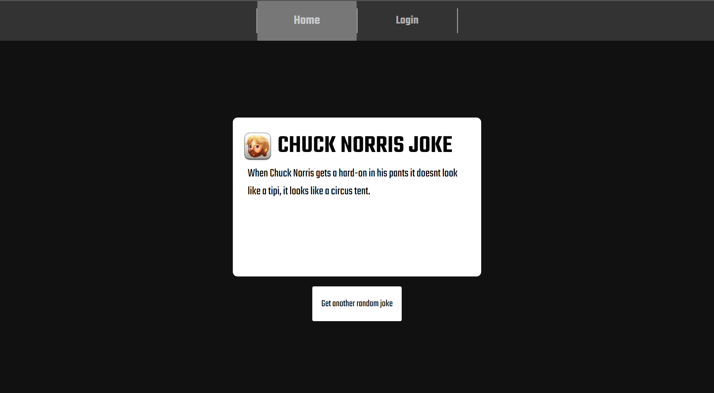
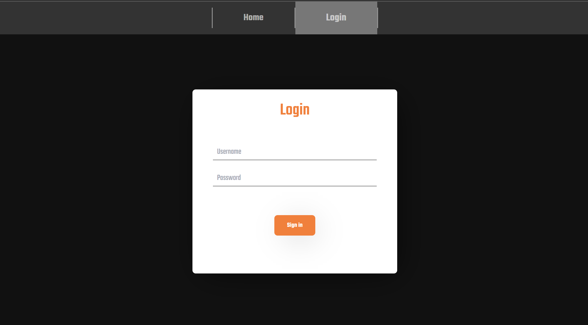
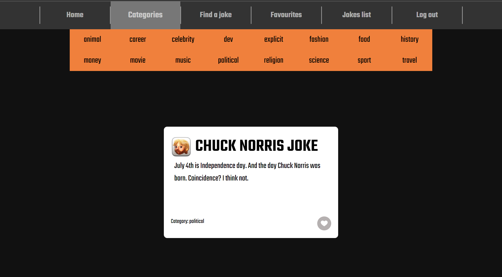
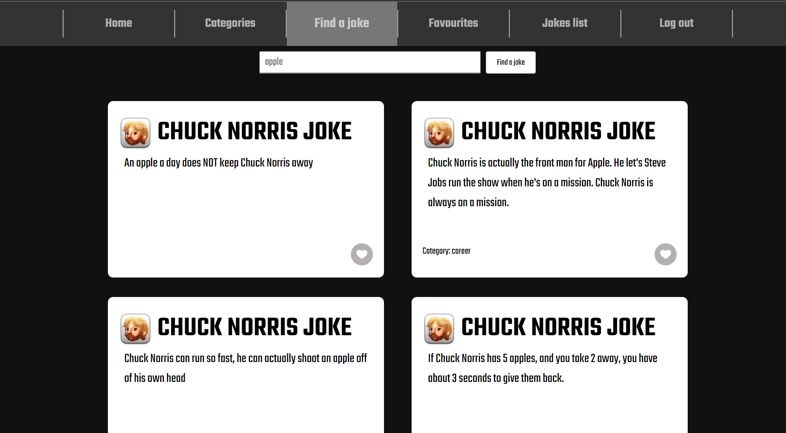
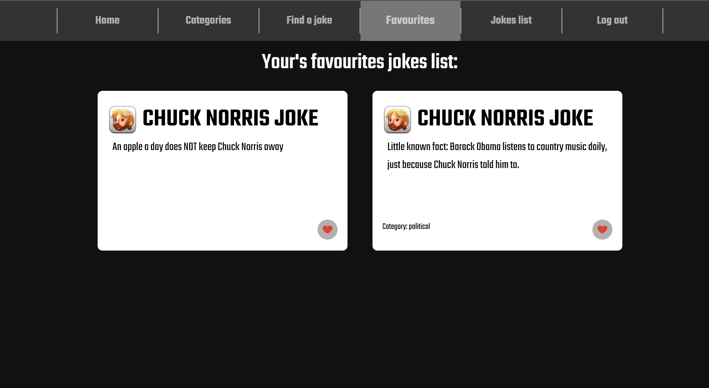

# React TypeScript App with Vite, Tailwind CSS, and APIs


## Table of Contents

- [Application Overview](#application-overview)
- [Features](#features)
- [Screenshots](#screenshots)
- [Installation](#installation)
- [Usage](#usage)
- [APIs Used](#apis-used)
- [Technologies Used](#technologies-used)
- [Contributing](#contributing)
- [License](#license)

## Application Overview

This application allows users to browse jokes about Chuck Norris. It includes a login system and provides the ability to like specific jokes.

## Features

- **Joke Browsing:** Search and browse jokes about Chuck Norris using the [Chuck Norris API](https://api.chucknorris.io/).
- **Login System:** User authentication to log in and access personalized features.
- **Like Jokes:** Users can like their favorite jokes.

## Screenshots








## Installation

To get started with this project, follow these steps:

1. **Clone the repository:**

   ```sh
   git clone https://github.com/nowigor/ChuckNorrisJokes
   cd chucknorrisjokes
   ```

2. **Install dependencies:**

   ```sh
   npm install
   ```

3. **Start the development server:**

   ```sh
   npm run dev
   ```

## Usage

Once the development server is running, you can view the app by navigating to `http://localhost:5173` in your web browser.

## APIs Used

### Chuck Norris API

This API provides random Chuck Norris jokes.

- **Endpoint for random jokes:** `https://api.chucknorris.io/jokes/random`
- **Endpoint for jokes with a query:** `https://api.chucknorris.io/jokes/search?query={query}`

### DummyJSON API

This API provides fake JSON data for testing and prototyping.

- **Endpoint for products:** `https://dummyjson.com/products`
- **Endpoint for users:** `https://dummyjson.com/users`

## Technologies Used

- **TypeScript:** A statically typed programming language that builds on JavaScript.
- **React:** A JavaScript library for building user interfaces.
- **Vite:** A build tool that aims to provide a faster and leaner development experience for modern web projects.
- **Tailwind CSS:** A utility-first CSS framework for rapidly building custom user interfaces.
- **React Router:** A library for routing in React applications.

## Contributing

Contributions are welcome! Please fork this repository and submit a pull request with your changes.

## License

This project is licensed under the MIT License. See the [LICENSE](LICENSE) file for details.
s
